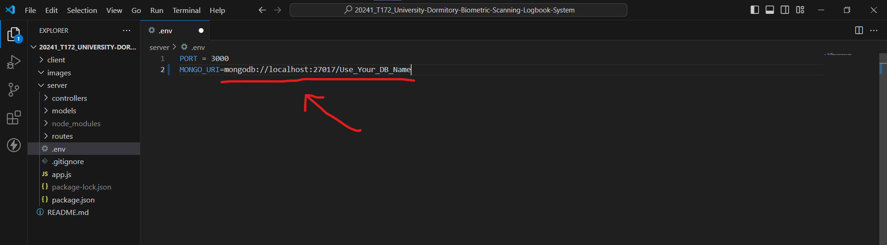
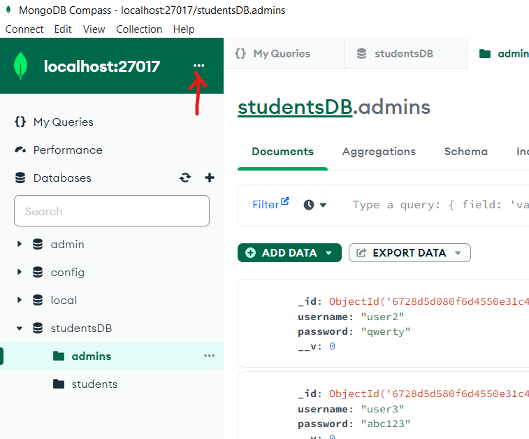
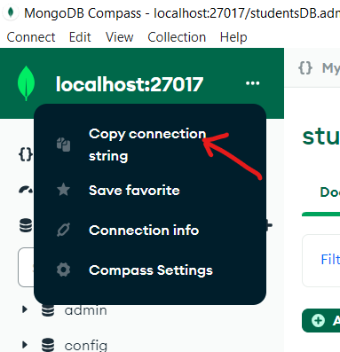

# Introduction
<div align="center"></div>

## University Dormitory Biometric Scanning Logbook System

### About Us
Biometric Scanning Logbook System (BSLS) is a seamless attendance tracker and manager for the students and staff of Mahogony Domitory.

The goal of this project system is to improve efficiency, integrity, user experience, and security of the students and staff's logbook attendance of the Bukidnon State University Mahogany Dormitory. Using fingerprint scanning for quick and seamless in and out attendance, and managing accounts, recent student activity and more for the admins of the dormitory. The system has a feature if the student are not able to come back at night, they will sent a message or mail alerting close friends and family.

### Group Memebers
We are the ZetaTech Biometric :rocket:, and this is our team:

| Names | Roles |
|-------|-------|
| Louise Clark Publico | Full Stack Developer :computer: |
| Joshua Camacho | Full Stack Developer :computer: |
| Alexa Gin Jagape | Front End Developer :pencil2: |
| Wrencil Caballero | Back End Developer :cd: |

# How to run the system?

### Setting Up MongoDB for your Server for our System.
Currently, to successfully run our server system with MongoDB, you'll need to configure your connection string. Follow these steps to set up the necessary environment:

1. Open the .env File
Locate the .env file in the server folder of your project. This file contains environment variables for your application.

2. Update the MongoDB Connection String
Remove the Example Connection String: Look for the existing MongoDB connection string in the .env file. It usually looks like this:



Get Your MongoDB Connection String:
Open MongoDB Compass.
Connect to your MongoDB server.
Find the connection string by clicking on your database and copying the Connection String.





3. Paste Your Connection String
Replace the existing connection string in the .env file with your own MongoDB connection string.

4. Save the Changes
After updating the .env file with your connection string, save the changes.

5. Confirm Setup
Your MongoDB connection is now set up. You can proceed to use the following functions in your application:

```
Get All Students: getStudents()
Get a Single Student: getStudent()
Add a New Student: postStudent()
Update an Existing Student: updateStudent()
Delete a Student: deleteStudent()
```

That's it! Your server is now configured to connect to your MongoDB database. :grinning: :thumbsup:

__The how to run the system will change over time.__
